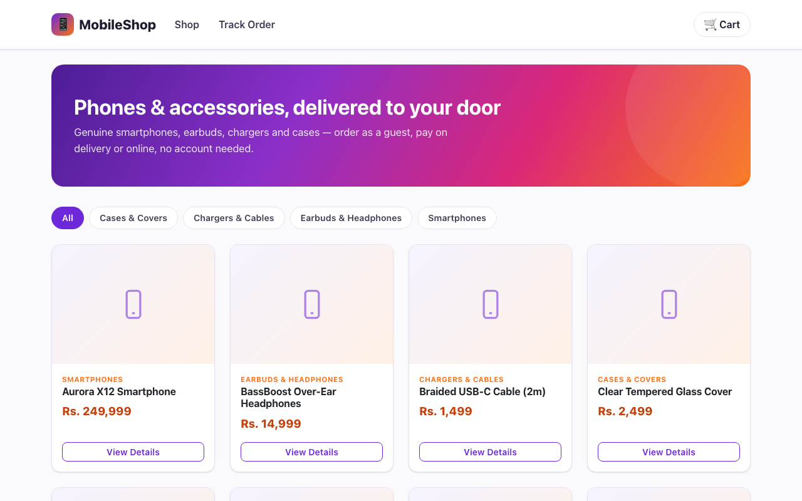
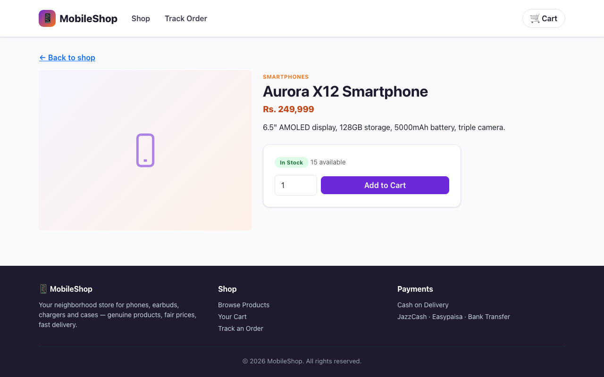
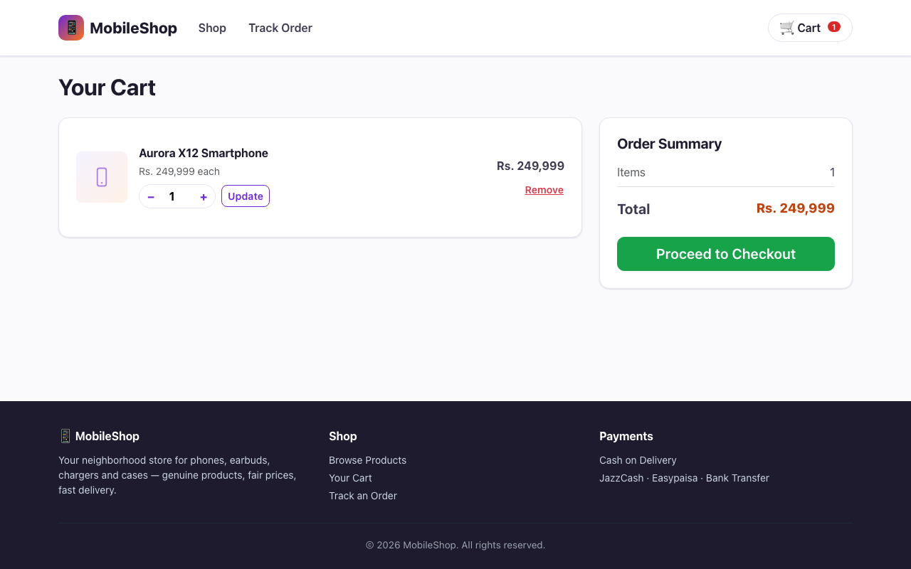
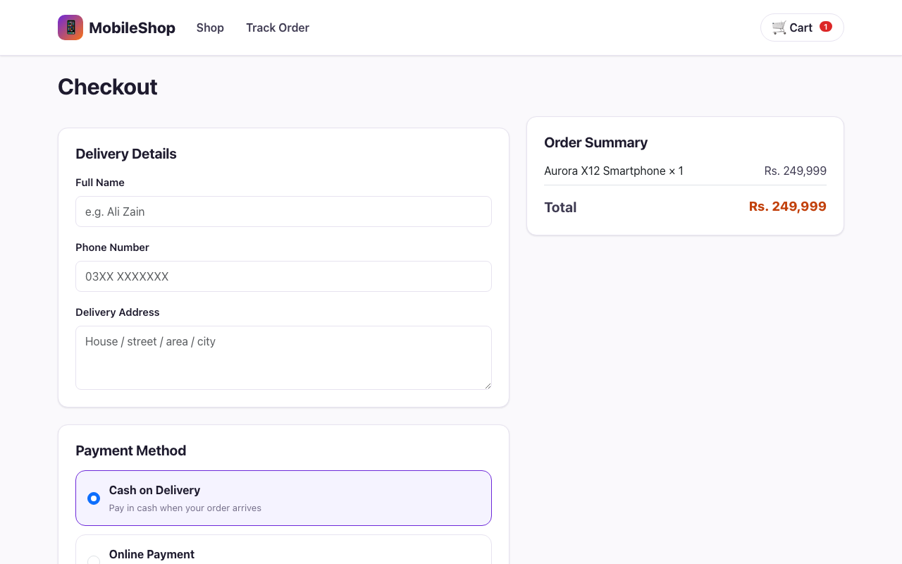
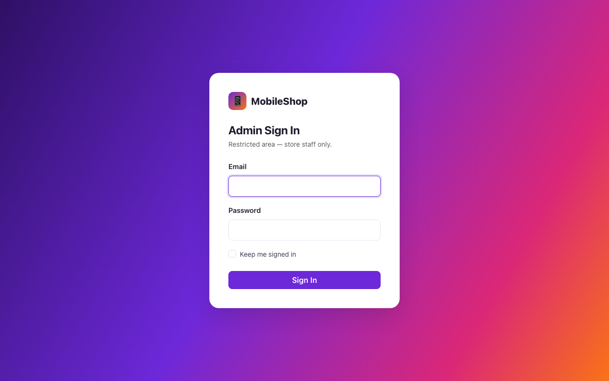
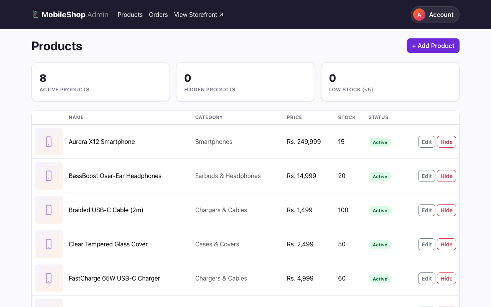
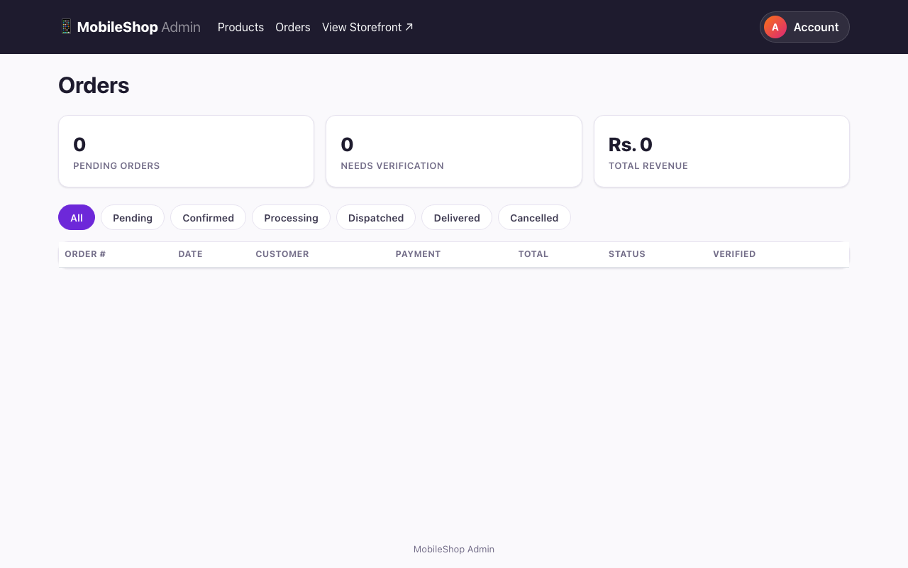

# E-commerceForCommunicationStore
### Mobile Shop

A small e-commerce site for a mobile phone & accessories shop, built with ASP.NET Core Razor Pages, EF Core, and PostgreSQL.



## Features

- Product catalog with categories, images, stock, and pricing
- Guest checkout — no account needed, just name/phone/address
- Cash on Delivery or online payment (JazzCash / Easypaisa / bank transfer) with screenshot upload as proof
- Order tracking by order number + phone
- Admin panel:
  - Product CRUD with soft delete via an `IsActive` flag
  - Order pipeline: Pending → Confirmed → Processing → Dispatched → Delivered / Cancelled
  - Manual buyer/payment verification per order
  - Self-service email & password changes, no email server required

## Stack

| Layer      | Tech                              |
|------------|------------------------------------|
| Backend    | ASP.NET Core 10 (Razor Pages)       |
| Database   | PostgreSQL + EF Core (Npgsql)       |
| Auth       | ASP.NET Core Identity (admin only)  |
| Frontend   | Bootstrap 5                         |

## Screenshots

<table>
<tr>
<td></td>
<td></td>
</tr>
<tr>
<td></td>
<td></td>
</tr>
<tr>
<td></td>
<td></td>
</tr>
</table>

## Getting started

### Prerequisites

- [.NET SDK](https://dotnet.microsoft.com/download) 10.0+
- PostgreSQL 14+

### Setup

1. Create a database:
   ```bash
   createdb mobileshop
   ```

2. Update the connection string in `appsettings.json` if your Postgres user/host differs from the default.

3. Run the app — migrations and seed data (sample categories/products + an admin account) apply automatically on first run:
   ```bash
   dotnet run
   ```

4. Open `http://localhost:5137`.

### Admin access

Admin login is at `/admin-login` (not linked from the storefront). Default seeded credentials:

```
Email:    admin@mobileshop.local
Password: Admin@12345
```

Change the email/password from the account menu after logging in.

## Project structure

```
Pages/            Storefront + checkout + order tracking
Pages/Admin/      Admin panel (products, orders, account)
Models/           EF Core entities
Data/             DbContext, migrations, seed data
Services/         Cart service (session-based)
```
